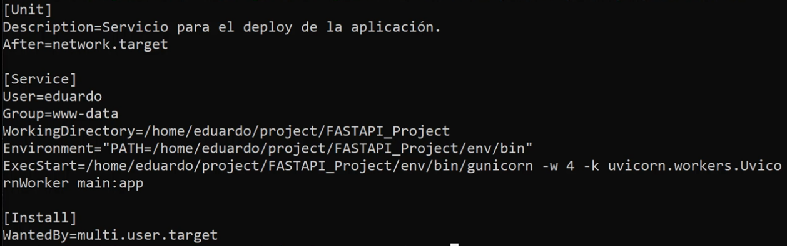
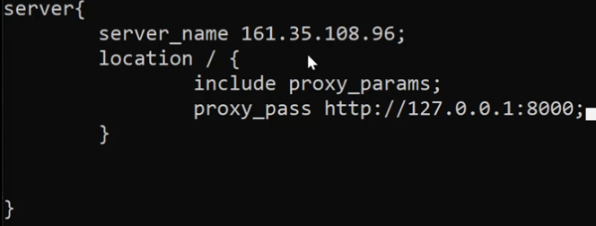

# Deploy
Se hará el deploy o despliegue a producción el proyecto "Reseña de peliculas", lo encontramos en [este repositorio](https://github.com/CeAcheRistian/Servicios-web)

## Configuración local
Dentro de la carpeta del proyecto, ingresamos al entorno virtual. Para correr este proyecto en local se deben hacer todas las instaciones pertinentes. Para este proyecto es fastApi, peewee, uvicorn, pyjwt, python-multipart, mysqlclient.

Crearemos el archivo requierements, archivo de suma importancia ya que en el se conoce que dependencias se necesitan y su versión para su reinstalación en caso de que alguien quiera correr la app en local. Para crear este archivo: __pip3 freeze >> requirements.txt__ Con freeze se listan todas las dependencias del entorno virtual, con el stdout lo escribimos al archivo requirements.txt.

Creamos el archivo: __local_settings.py__, en el cual colocaremos todas las configuraciones locales, el usuario y contraseña con el cual nos logeamos en la base de datos. En database importamos las constantes y sustituimos sus valores de la instancia de MySQL. __ESTE ARCHIVO NO SE MANDA AL REPOSITORIO REMOTO__

Es posible que la base de datos no exista, para saber si existe hacemos: _sudo mysql -u root_, en root puede ser el usuario que tenga la base se datos y tiene contraseña se especifica la opción -p y después del enter colocamos la contraseña. Dentro hacemos: _SHOW DATABASES;_ para ver si existe, sino la creamos: _CREATE DATABASE fastapi-project_

Para ignorar archivos que no queremos o no debemos mandar al repositorio local, ya sea al crear un nuevo repo con github o buscando en google: _git ignore python_ y obtenemos todo el archivo. Y pegamos en un archivo de nombre ".gitignore" al mismo nivel que main.py.

Para ver que todo quedó fino, ejecutamos el servidor: _uvicorn main:app --reload_

## Configuración de mySQL
Para un doplet de Digital-Ocean:

Ingresamos al servidor: _ssh alias_ o  _nombre@ip_, actulizamos los paquetes del sistema: _sudo apt update_. Instalamos mysql server: _sudo apt install mysql-server_. 

Creamos un nuevo usuario en la base mysql, con este nuevo usuario la app web se podrá conectar con la base. Nos autenticamos con el servidor: _sudo mysql_, creamos el usuario: _CREATE USER 'nombre del usuario'@'localhost' IDENTIFIED BY 'contraseña';_. Le otorgamos todos los permisos a este usuario: _GRANT ALL PRIVILEGES ON *.* TO 'usuario'@'localhost' WITH GRANT OPTION;_, el primer asterisco son los permisos de todas las bases de datos y el segundo son todas las tablas. Creamos la base de datos: _CREATE DATABASE nombre-de-la-base;_, para ver que se creo y todas las bases: _SHOW DATABASES;_

## Ejecución local en el server
Clonamos el proyecto y ejecutamos en el servidor remoto. Creamos una carpeta que almacenará el proyecto, esta carpeta se debe encontrar en la ruta de: _~/_, dentro de la carpeta creada, clonamos el repositorio, ingresamos al repositorio, creamos un entorno de desarrollo, primero instalando todo lo necesario para el entorno. Dentro del entorno instalamos "wheel": _pip install wheel_ y _sudo apt install lib mysqlclient-dev_, la primera es para evitar errores en general y la segunda es para evitar errores con la base de datos. Instalamos todas las dependencias a través del archivo requirements: _pip install -r requirements.txt_

Creamos el archivo local_settings.py con nano, donde van las credenciales de la base de datos. Las constantes USER_DATABASE y PASSWORD_DATABASE con las mismas credenciales que el usuario de la base de datos apenas creada.

Si todo va bien, cuando se inicie el servidor todo debería ir bien, pero no se puede acceder a ese sitio desde otro lado.

## Gunicorn
Ejecutamos: _uvicorn --host 0.0.0.0 main:app_ con est indicamos a uvicorn que usamos la ip del servidor. Y con esto se puede acceder a la web. Pero el proceso puede terminar, se debe hacer un servicio para monitorear en todo momento la ejecución del servidor.

## Servicio
Creamos la unidad con las variables Description, After para Unit. 

User y Group para Service, en User debe ser el usuario con el cual se a autenticado con el servidor y en el grupo se especifica "www-data", seguido de WorkingDirectory con la ruta del proyecto, Enviroment="PATH=/home.../bin" con la ruta del entorno y ExecStart para el comando a ejecutar para levantar el servidor, como se est;a usando un entorno virtual sería algo así _=/home/.../bin/gunicorn -w 4 -k uvicorn.workers.UvicornWorker main:app_ Este comando específico es para el proyecto de fastAPI.

Y en Install va _WantedBy=user.multi.target_  Y listo

Se guarda el archivo y para correr el servicio: _sudo systemctl enable (nombre del proyecto)_, para iniciarlo con un start en vez de enable y vemos el estatus con status en vez de enable.

Pero todavía no se puede acceder desde cualquier sitio :C

## Nginx
Es el encargado de responder a las peticiones que se le solicite al servidor.

Instalamos nginex: _sudo apt install nginx_ . Para confirmar esto, accedemos a nuestra ip y nos dará un mensaje de bienvenida. Creamos un nuevo archivo: _sudo nano /etc/nginx/sites--available/(nombre del archivo)_ El nombre del archivo debe ser el mismo que del servicio para una mejor identificación. DEntro del archivo creamos un bloque de nombre server{} y dentro de los corchetes y con identación van las variables: _servername (la ip);_ En otro renglon indicamos que cualquier peticion que se realice sobre / es decir, todas las peticiones, se responderán mediante unicorn el cual se encuentra de forma local: _location / {}_ y dentro del nuevo bloque va: *include proxy_params; proxy_pass http://127.0.0.1:8000* Después de cada punto y coma es un salto de línea. Con el proxypass se especifica que el servidor local, el de gunicorn va a responder a todas las peticiones que se reciba de nginex, por eso esa ip y el puerto.

Se va a sobreescribir las configuraciones de nginex. Creamos un link del archivo: _sudo ln -s /etc/nginx/sites-available/(nombre del archivo) /etc/nginx/sites-enabled_ Y listo, solo falta reiniciar nginex, el cual es un servicio: _sudo systemctl restart nginx_ , checamos el estado con status.

Y listo ya se encuentra en producción, si ingresamos usuarios, reseñas y peliculas estás irán en la base de datos que se creo y configuró recientemente.