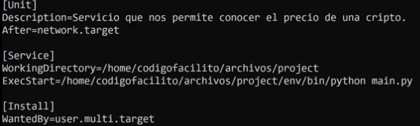

# Servicios
> Todo lo que ocurre en la consola es dentro del servidor, no en local.
## Introducción
__Systemd__ es el encargado de gestionar todos los servicios en el sistema operativo cuando el kernel inicia. Pero no es un estándar global, esto es en las versiones recientes.

Systemd trabaja con _unidades_, objetos que contienen instrucciones sobre cómo iniciar tareas comunes, como lo pueden ser los demonios. Además no spermiten almacenar dependencias que pueden ser utilziadas por otras unidades.

Existen diferentes tipos de unidades:
- Service units
- Target units
- Socket units
- Mount units

Como administradores usaremos la interfaz: __Systemctl__, con la cual podremos interactuar con Systemd.

Comandos más últiles:
- sysmctl list-units 
- sysmctl start (unidad)
- sysmctl stop (unidad)
- sysmctl restart (unidad)
- sysmctl status (unidad)

## Crear demonios
Creamos un script con la fecha actual, importamos datetime y time y dentro del if name = main, tenemos un bucle infinito donde llamamos a now y a strftime para darle el formato (Y,m,d H:M:S). Abrimos el archivo donde se almacenarán las fechas, con append claro, y escribirmos la fecha con el formato y un salto de linea. Dormimos el proceso durante 5 segundos.

Ejecutamos: _sudo nano /etc/systemd/system/(nombre servicio).service_ creamos un servicio. Dentro del archivo  hay tres apartados [Unit], [Service] e [Install] Son como encabezados que todo archivo del tipo servicio debe tener, debajo de Unit usaremos la variable _Description=esto es una descripcion_ y le damos una descripcion sencilla del servicio. Debajo de Service, indicamos con la variable _WorkingDirectory=_ la ruta donde se encuentra nuestro archivo py, con  _ExecStart=_ indicamos el comando que ejecutamos, como: python3 archivo.py. Debajo de Install, la variable _WantedBy=default.target_ indicando que se va a iniciar cuando el sistema inicie.

Para iniciar el servicio llamamos a __Systemctl__ con: _sudo systemctl enable (nombre servicio)_ y lo iniciamos con: _sudo systemctl start (nombre servicio)_, para verificar si todo va bien: _sudo systemctl status (nombre servicio)_, nos debe indicar que está activo y en ejecución. Para deterlo cambiamos status por _stop_ en el comando.

Si queremos modificar algo del archivo .service, lo editamos. Vemos lo reiniciamos, checamos el status, lo finalizamos y al finalizar ejecutamos el comando: _sudo systemctl daemon-reload_

## Journald
Herramienta que es un servicio encargado de almacenar todos los _logs_ de todos los servicios. Es una base de datos centralizadas de logs. La información se amacena en archivos binarios en el directorio: _/run/log/format_. Con la interfaz __Journalctl__ podremos interactuar con Journald. Muy similar que systemd y systemctl pero con logs.

## Módulo logging
Es un módulo de python para testear el código, es la sustitución a los prints en consola para saber que el código va bien. EL módulo logging maneja 5 tipos de mensajes:

- debug (10): permiten testear cierta parte del código
- info (20): los mensajes normales en el flujo de ejecución
- warning (30): mensajes de alerta
- error (40): errores como exepciones
- critical (50): alertas de que algo fallo y no se puede continuar.

Depende de las necesidades se usará el tipo de mensaje. Tal cual se sustituye un print por un: __logging.debug()__ o por un __logging.info()__, ... Obviamente se debe importar el módulo. 

Cada tipo de mensaje tiene un número asociado que es su importancia, debug es 10, info 20, ... critical 50. Siendo critical el más importante, esto es importante ya que logging está configurado  para mostrar solo mensajes en consola con un nivel 40 o 50. Para cambiar esta configuración hacemos: __logging.basicConfig(level=(##))__ modificamos la configuración para que sí muestre los mensajes del tipo que queremos, especificando el numero del nivel desde el cual se mostraran los mensajes. O mejor aún, le pasamos una constante _level=logging.DEBUG_ para que se lea mejor.

Dentro de la llamada de la configuración, exite otro parámetro: _format=_ con el cual podemos modificar el formato que se visualiza en la consola, para conocer el tipo de mensaje y el mensaje: _'%(levelname)s - %(message)s'_, para la fecha exacta de impresión: _asctime_, nombre del hilo: _threadName_, nombre del proceso: _processName_.

> El uso de %()s hace referencia a la forma de intercalar cadenas de texto en un diccionario. Es un formato de cadenas como lo f-strings o más cercano los s-strings.

Para almacenar todos los mensajes creados en un archivo, usamos otros dos paráemtros: _filename='nombre-archivo.log'_ y _filemode='a'_. Especificando el nombre del archivo para los logs y el tipo de escritura. 

## Scripts pt 2

> Aquí empeiza el proyecto de saber el precio de una criptomoneda y almacenarlo en logs.

Creamos un entorno virtual. primero instalamos python3-dev, python3-pip, python3-venv. Ejecutamos: _python3 -m venv env_ y lo activamos: _source env/bin/activate_.

Dentro instalamos request: _pip install request_.

Dentro de main.py importamos time y requests. Creamos una función para obtener los precios actuales de las criptomonedas, por parámetro recibirá un id que será la criptomoneda a obtener. 

Dentro almacenamos la url de la api que es una petición para obtener el precio de una criptomoneda, sustituimos el nombre de la criptomoneda por el id pasado por parámetro. En otra variable almacenamos la respuesta de la petición get haceha con request y le pasamos la varaible hecha anteriormente.

Accedemos a la propiedad status_code y si es el codigo 200, que significa exito entonces almacenamos la respuesta del método json que nos dio el servidor en la variable de la respuesta y retornamos la propiedad id y el valor "usd".

Dentro de un if  name = main, creamos un bucle infinito ya que haremos esta petición a la api cada 5 segundos y haremos que este script se convierta en un demonio para ser ejecutado de manera indefinida.

Llamamos a la función con el id de 'bitcon', almacenamos su valor retornado, creamos una variable que almacene el retorno de la función, casteado a str y un salto de linea.

Abrimos/creamos un archivo con append para almacenar la varaible anterior, que son los precios y para finalizar el if, fuera del with open, ponemos a dormir la ejecución 5 segundos.

## Servicios pt 2
Para ejecutar el script anterior como un demond debemos crear un servicio, para esto usamos "Unidades" con extención service. 

Ejecutamos: _sudo nano /etc/systemd/system/(nombre servicio).service_. Como ya sabemos y si no, viene en el subtema de __Demonios__, debemos poner tres encabezados/separadores/secciones: [Unit], [Service] e [Install].

Debajo de la linea de Unit va la variable que es una descripción: _Description=Esto es una descripcion_, después de la variable after, en la que definimos exactamente cuando queremos que el servicio inicie, especificamente cuando se realiza la petición a la api y queda así: _After=network.target_, con esto indicamos a systemd que este servicio de inicia cuando ya se tenga conexión a internet. 

En la sección de Service especificamos el directorio de trabajo: _WorkingDirectory=/home/...._ y para ingresar al entorno virtual, porque se creo uno y este tiene varios interpretes de python y se debe correr los archivos de python con estos interpretes especificamente usamos la varaible: _ExecStart=/home/.../env/bin/python main.py_ especificamos la ruta del entorno virtual, en la carpeta bin del entorno se encuentran los interpretes de python.

En la sección de Install colocamos que hay varios targets con: _WantedBy=user.multi.target_, Y listo el archivo service quedó.

Habilitamos systemctl con: _sudo systemctl enable (nombre del servicio)_, nos retorna un mensaje del link creado. Iniciamos el servicio cambiando "enable" por _start_. Para ver como va el proceso cambiamos 'start' por _status_. Para deterner el servicio: _stop_ 

## Logs
Con el modulo login podremos generar los logs, entonces hacemos un refactor al archivo principal main.py.

Importamos logging, llamamos al método de las configuraciones básicas, creamos un objeto del tipo logger y con este objeto definiremos los tipos de mensajes queremos en consola, ya sabemos que van por niveles. Entonces en el método setLevel pasamos la constante asociada como logging.INFO.

Antes de almacenar los precios en el archivo, ejecutamos _logger.info()_, la pasamos la variable que contiene el precio y el salto de linea para que se imprima en consola.

## Logs con Journald
Para almacenar los log en la base de datos de journlad, ocuparemos la libreria cysystemd de python. Instalamos las librerías: _build-essential_ y _libsystemd-dev_. Ahora, con el entorno activado, instalamos _cysystemd_.

Modificamos por 3ra ocasión nuestro archivo main.py. Importamos el modulo _journald_ de la libreria cysistemd. Con el modulo journald podremos generar un objeto del tipo loghandler el cual permite almacenar los logs en la base de datos de journald. 

El objeto logger creado en el subtema anterior, manda a llamar un método para agregar un manejador de log, el cual es nuestro journald_handler.

De manera opcional podemos modificar el fomato de salida, la variable journald_handler llama al método formatter y como argumento le pasamos la llamada del método de formato de la varaible loggin y como argumento el formato. Es un método que tiene como argumento otro método. El tipo de formato y su significado están en el subtema de logging.

Y listo, con la importación, la instancia del objeto y la ejecución del método, podremos almecenar los logs en la base de datos de journald, para así realizar consultas a esa base.

Reanudamos el servicio si es que estaba detenido, para saber si está iniciado hacemos: _sudo systemctl status (nombre del servicio)_, si está inactivo usamos restart en vez de status.

Con el servicio activo, verificamos la base con: _sudo journalctl -u (nombre del servicio)_, accediendo unicamente a los logs de nuestro servicio.

